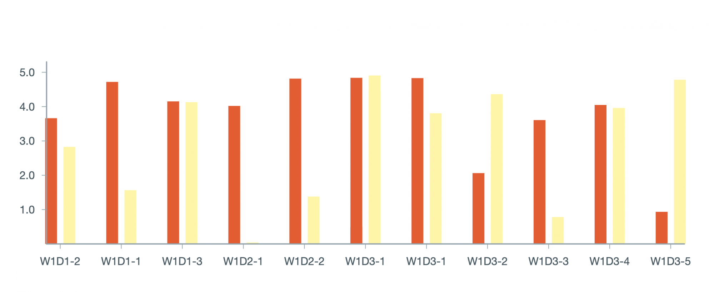
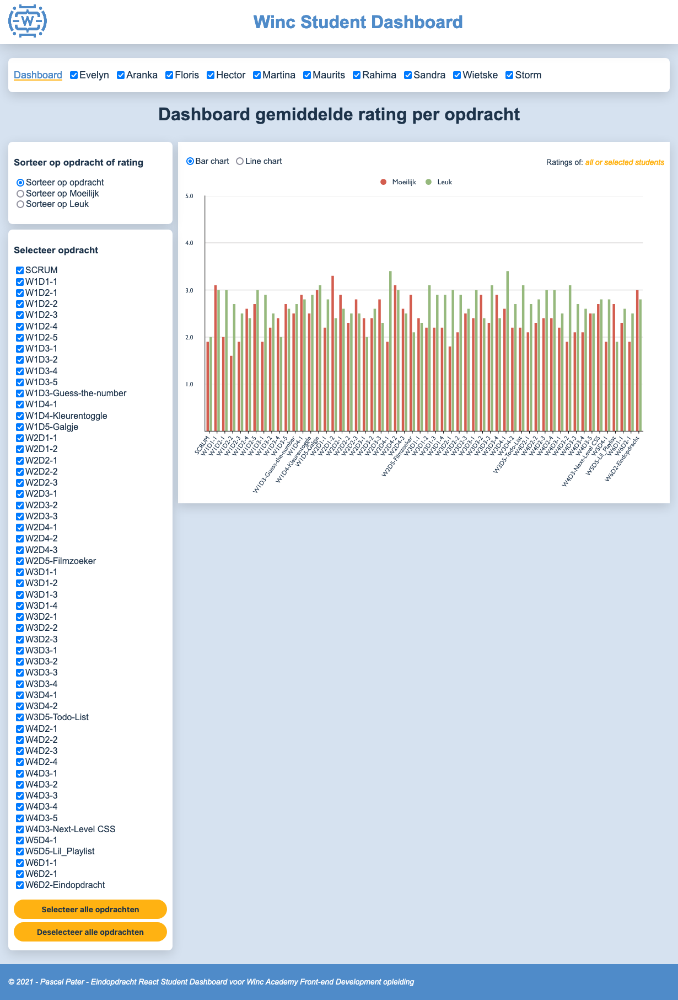
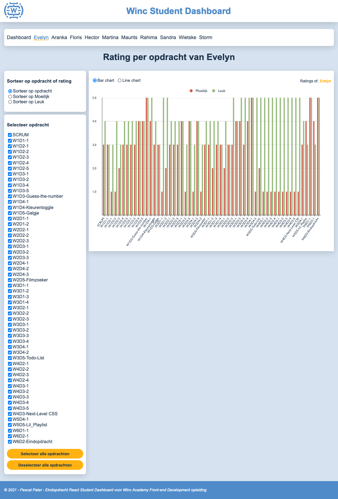
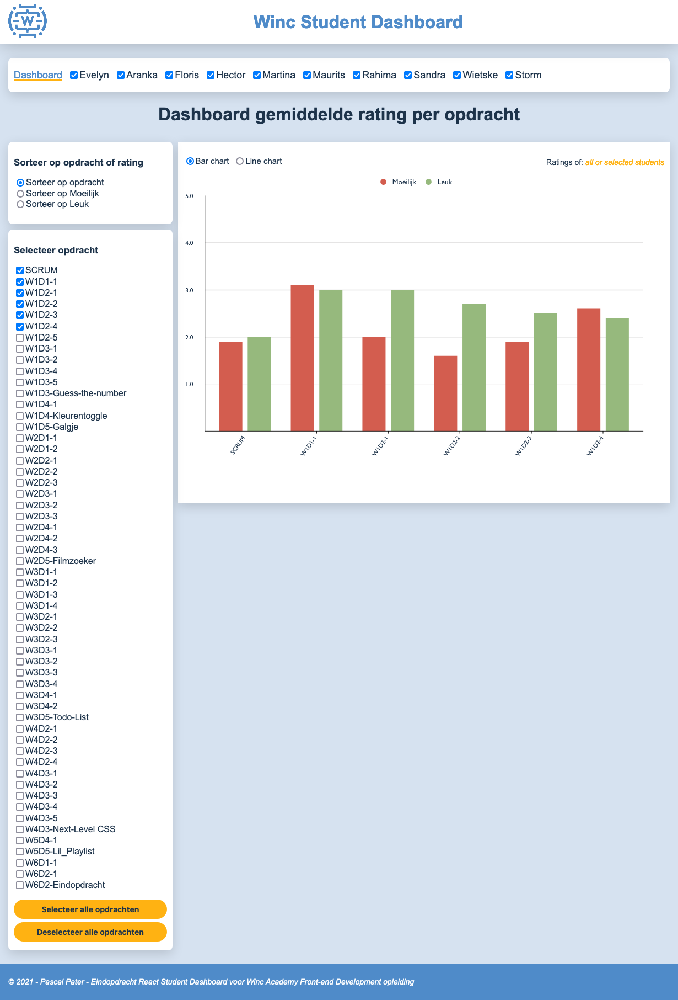
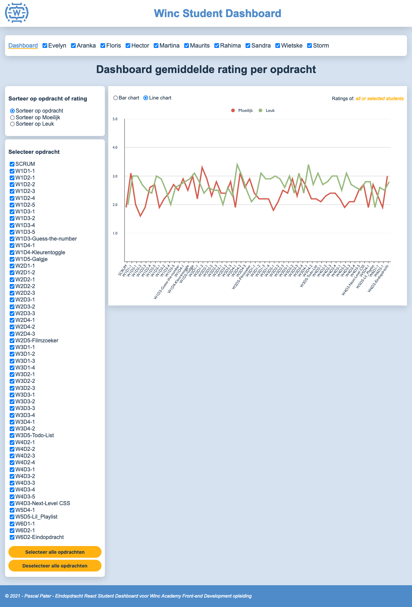

# Eindopdracht React Student Dashboard

[Screenshots van React Student Dashboard](#screenshots)

Als eindopdracht gaan jullie een "real life" project maken. Dit wordt een project waarvan het eindresultaat dus ook echt voor de Winc Academy gebruikt gaat worden: namelijk een Student Dashboard!

**Doel:** het gemakkelijk maken voor Winc docenten om in één overzicht te zien hoe de studenten de opdrachten evalueren

**Wat is de huidige situatie:** Excellen, Excellen, Excellen.....

**Design:** We zouden graag, per opdracht, de evaluatie van iedere student willen zien in een "Bar Chart".

**Tools:** Maak gebruik van een JavaScript framework zoals React.

## De data

Onderstaande link is naar een spreadsheet bestand (in Google Docs) met een berg nep data (ook wel mock data), met nep studenten. Dit zijn de resultaten van studenten zodra zij alle opdracht-evaluaties hebben ingevuld.

Winc Eindopdracht – Studenten Mock data

Zoals jullie kunnen zien heeft deze data de volgende structuur:
- Naam van student
- Naam van de opdracht / project (met ook de project code erin)
- Cijfer hoe leuk de opdracht was
- Cijfer hoe moeilijk de opdracht was

Het is aan jullie om de data correct te modelleren en te structuren. Ga niet de data over lopen typen, daar is het veel te veel data voor.

Een goede manier om met data te werken is een csv-bestand. Je kunt de data van Google Sheets downloaden als csv. Je kunt ook direct met de data vanuit Google Sheets werken.

Gebruik een zoekmachine om een slimme manier voor te vinden voor het werken met de data. Het kan overigens op meerdere manieren. Als voorbeeld heeft node een lijst met packages om csv te verwerken.

## Requirements

Jouw WebApplicatie moet het volgende weergeven

1. **Dashboard Overview User-story:** Als gebruiker wil ik als ik de homepage van de applicatie open een overzicht zien in de vorm van een **staafdiagram** van de evaluaties (leuk & moeilijk) van alle studenten.

    
    Als gebruiker moet ik in 1 oogopslag onderscheid kunnen maken tussen de opdrachten en de leuk/moeilijk evaluatie. Zorg ervoor dat er visueel een duidelijk onderscheid wordt gemaakt, door bijvoorbeeld met duidelijke kleuren te werken. Zie het voorbeeld met rood en geel hieronder.

2. **Per student aparte routing** Als gebruiker wil ik een lijst zien van de namen van alle studenten en op een van deze studenten kunnen klikken. Wanneer ik op een student-naam klik word ik naar de route `/{naam-van-student}` gebracht. De staafdiagram past zich aan met de data van alleen deze student.

Tip: de chart blijft hetzelfde op de X en Y as, krijgt alleen "minder" data, namelijk de data van 1 student.

3. **Design:** Maak een tool waar je trots op bent en wat je aan een toekomstige werkgever zou willen laten zien. We letten vooral op: leesbaarheid van de grafieken.

4. **Slicen en dicen. - Kies één van de onderstaande manieren:** Als gebruiker van de tool kan je op een aantal manieren de data "slicen en dicen".

    - Optie 1: Als gebruiker wil ik dmv een checkbox kunnen aangeven of ik in de staafdiagram alléén wil laten zien hoe leuk de opdracht was, alléén wil zien hoe moeilijk de opdracht was, of beide.

    - Optie 2: Als gebruiker wil ik, naast het filteren op 1 persoon, ook kunnen filteren op meerdere personen. Ik wil daarom bij het overzicht van mijn studenten een checkbox zien die ik kan

        - aanvinken als ik de data van deze specifieke student wil includeren in mijn grafiek

        - uitvinken als ik de data van deze specifieke student wil uitsluiten uit mijn grafiek.

    - Optie 3: Als gebruiker wil ik een line-chart representatie zien van mijn data die het gemiddelde cijfer weergeeft voor "leuk" en het gemiddelde cijfer voor "moeilijk".

    

    - Optie 4: Als gebruiker wil ik kunnen zien hoe 1 specifieke opdracht heeft gescoord. Daarom wil ik een lijst zien van alle opdrachten die ik kan aanvinken om mij een staafdiagram te laten zien met op de y-as de score (zoals eerder) en op de x-as de namen van de studenten.

### Grafieken maken met een Library!

Je bent vrij om je eigen grafieken-library uitkiezen en gebruiken, een relatief simpele library is:

Victory. Hier een voorbeeld van het gebruik van de Victory graph library:
WincAcademy/StudentDashboardExample

## Bonus features

- Zorg dat men de data op meer dan 1 manier kan "slicen en dicen" (zie requirement 3).
- Tabel overzicht van alle data ⇒ dus als een Excel spreadsheet. Je mag hierbij zelf bepalen hoe je de kolommen / rijen wilt structureren:
    - Je kunt nog steeds kan filteren op alle bovenstaande manieren
    - Toevoegen van sorteren per data kolom
- Gebruikers profielen. Door gebruik te maken van Mockaroo of UInames.com kunnen jullie snel en eenvoudig objects ophalen met nep data erin. Voor elke studentenpagina kunnen jullie vervolgens een profiel toevoegen en de fictieve studenten verder verrijken met:
    - Achternaam
    - Leeftijd
    - Telefoonnummer
    - Email adres
    - Photo (URL)
    - Let wel op de rate limiting van deze API's – als je te vaak en teveel een call doet wordt je (tijdelijk) geblokkeerd: haal de data één keer op en sla het dan lokaal op in een JSON file
- Alles opslaan en beheren in Redux .
- Sorteren van de bar charts van opdrachten op gemiddelde cijfer (hoog naar laag of laag naar hoog).
- Sorteren van de studenten op gemiddelde cijfers (hoog naar laag of laag naar hoog).

## Tips & Tricks

- Maak een plan: niet gelijk in de code duiken. Ga eerst heel goed na wat er van je gevraagd wordt:
    - Welke data heb ik beschikbaar?
    - Wat moet ik uiteindelijk met deze data doen?
    - Daar rekening mee houdend: in welke vorm moet ik de data dan "gieten" om de features mogelijk te maken?
    - Teken uit welke componenten je nodig (denkt) te hebben – probeer gelijk al een onderverdeling te maken tussen (slimme) container components en visuele (domme) components
    - Denk ook alvast na over de structuur en bestanden van de verschillende onderdelen (vergeet hierbij niet dat gepaste en goede benaming goud waard is!)

- "Afkijken" mag - help elkaar(!) en gebruik elke bron die je (online) kunt vinden. Maar, uiteraard geen code kopiëren (= plagiaat).
- Je mag een CSS Framework (zoals Bootstrap) gebruiken.

## Screenshots:

### Bar Chart

### Student Page

### Assignment Selection

### Line Chart

### Responsive dashboard

